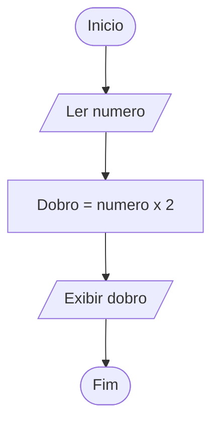
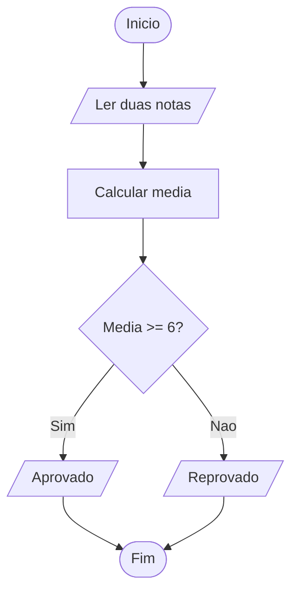
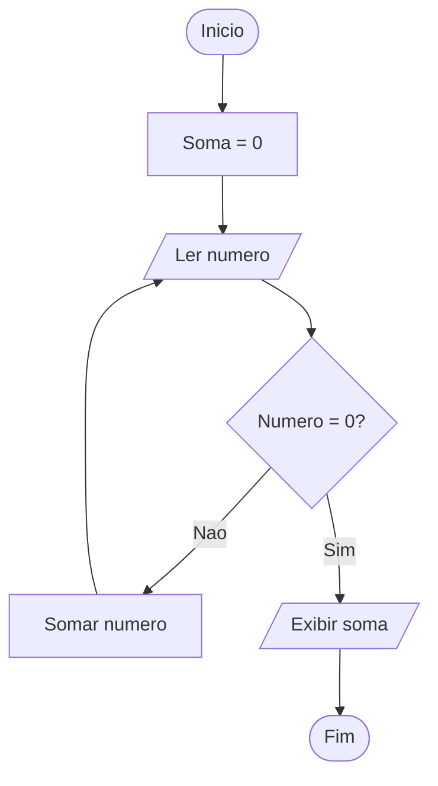

# Capítulo 03 — exercícios resolvidos

Estas são resoluções propostas e exemplos de caminhos possíveis. Não são a única forma de resolver, nem necessariamente a melhor. Você pode criar sua própria solução, inclusive uma melhor, e compartilhá-la para que outros leitores comparem as abordagens.

[Como compartilhar outra solução](../../../CONTRIBUTING.md) · [Índice](../README.md)

## Exercício 1

**Compartilhe sua resolução:** crie `alternativas/seu-nick/volume-1/capitulo-03/exercicio-01/`, coloque sua resposta ou código e um `README.md` com explicação e testes. Não altere esta resolução proposta. [Veja como criar a pasta e enviar](../../../CONTRIBUTING.md).

**Enunciado** (página impressa 25, página 37 do livro completo):

Desenhe o diagrama de bloco para calcular o dobro de um número informado pelo usuário.

### Uma resolução possível

Use entrada, processamento e saída em sequência.



## Exercício 2

**Compartilhe sua resolução:** crie `alternativas/seu-nick/volume-1/capitulo-03/exercicio-02/`, coloque sua resposta ou código e um `README.md` com explicação e testes. Não altere esta resolução proposta. [Veja como criar a pasta e enviar](../../../CONTRIBUTING.md).

**Enunciado** (página impressa 25, página 37 do livro completo):

Crie um diagrama de bloco que leia duas notas e mostre se o aluno foi aprovado ou reprovado (média mínima = 6).

### Uma resolução possível

A média é a soma das duas notas dividida por 2; média igual a 6 aprova.



## Exercício 3

**Compartilhe sua resolução:** crie `alternativas/seu-nick/volume-1/capitulo-03/exercicio-03/`, coloque sua resposta ou código e um `README.md` com explicação e testes. Não altere esta resolução proposta. [Veja como criar a pasta e enviar](../../../CONTRIBUTING.md).

**Enunciado** (página impressa 25, página 37 do livro completo):

Faça o diagrama de um algoritmo que soma números até que o usuário digite 0.

### Uma resolução possível

Inicialize o acumulador antes do laço. Zero encerra a entrada; não altera a soma.



## Exercício 4

**Compartilhe sua resolução:** crie `alternativas/seu-nick/volume-1/capitulo-03/exercicio-04/`, coloque sua resposta ou código e um `README.md` com explicação e testes. Não altere esta resolução proposta. [Veja como criar a pasta e enviar](../../../CONTRIBUTING.md).

**Enunciado** (página impressa 25, página 37 do livro completo):

Transforme o diagrama do exercício anterior em pseudocódigo e código C.

### Uma resolução possível

Traduza a inicialização, a repetição com sentinela zero e a saída do fluxograma.

```text
INICIO
  soma <- 0
  LEIA n
  ENQUANTO n <> 0
    soma <- soma + n
    LEIA n
  ESCREVA soma
FIM
```

[Ver programa completo (C)](../c/capitulo-03/exercicio-04.c)

Entrada de exemplo (uma informação por linha):

```text
2
-1
3
0
```

Resultado esperado (trecho quando houver outras mensagens):

```text
Soma: 4.00
```

## Exercício 5

**Compartilhe sua resolução:** crie `alternativas/seu-nick/volume-1/capitulo-03/exercicio-05/`, coloque sua resposta ou código e um `README.md` com explicação e testes. Não altere esta resolução proposta. [Veja como criar a pasta e enviar](../../../CONTRIBUTING.md).

**Enunciado** (página impressa 25, página 37 do livro completo):

Pesquise e liste outras simbologias usadas em diagramas de bloco mais avançados (ex: conectores, subprocessos).

### Uma resolução possível

Além das formas básicas: um pequeno círculo indica conector na mesma página; o conector fora da página indica continuidade em outra folha; o retângulo com barras laterais representa processo predefinido ou subrotina; o cilindro pode representar armazenamento em banco de dados; a forma de documento identifica saída documental. Inclua uma legenda: convenções variam entre ferramentas.

---

**Quer entender os conceitos deste capítulo desde o início?** Conheça o livro completo *Lógica de Programação e Algoritmo*, de Igor Gomes: **[compre na Amazon](https://a.co/d/gTA39Jr)** ou **[adquira o impresso no Clube de Autores](https://clubedeautores.com.br/livro/logica-de-programacao-e-algoritmo)**.
